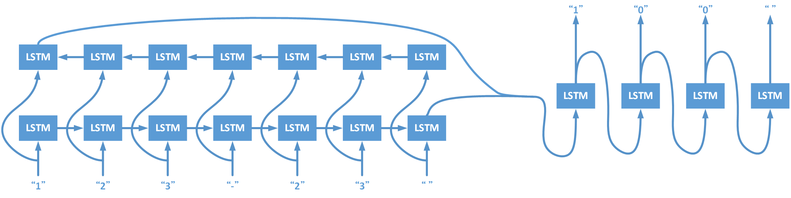

# Data Science and Artificial Intelligence Practice Homework
DSAI HW3-Substractor

## Prerequisite
- Python 3.6.4

## Install Dependency
```sh
$ pip install -r requirements.txt
```

## Usage
```sh
$ python main.py [-o OPTION] [-t TYPE] [-d DATA] [-m MODEL]
```
|                            | Description                                    |
| ---                        | ---                                            |
| **General Options**        |                                                |
| -h, --help                 | show this help message and exit                |
| **Operational Options**    |                                                |
| -o gen                     | data generation                                |
| -o train                   | training model                                 |
| -o report\_training\_data  | show all training data                         |
| -o report\_validation\_data| show all validation data                       |
| -o report\_testing\_data   | show all testing data                          |
| -o report\_accuracy        | show accuracy                                  |
| -o test                    | input formula by self                          |
| **Calculational Options**  | **Default `-t sub`**                           |
| -t sub                     | subtraction                                    |
| -t sub\_add                | subtraction mix with addition                  |
| -t multiply                | multiplication                                 |
| **Advance Options**        |                                                |
| -d DATA                    | input the path of training (or generation) data|
|                            | (default: `src/data.pkl`)                      |
| -m MODEL                   | input the path of model                        |
|                            | (default: `src/my_model.h5`)                   |


## Architecture


- Using sequence to sequence model
- Encoder: bi-directional LSTM (Hidden Size = 256)
- Decoder: LSTM (Hidden Size = 512)

| Layer (type)                    | Output Shape        | Param #    | Connected to                     |
| ------------------------------- | ------------------- | ---------: | -------------------------------- |
| input\_1 (InputLayer)           | (None, 7, 12)       | 0          |                                  |
| ------------------------------- | ------------------- | ---------- | -------------------------------- |
| bidirectional\_1 (Bidirectional)| \[(None, 512), ...  | 550912     | input\_1[0][0]                   |
| ------------------------------- | ------------------- | ---------- | -------------------------------- |
| reshape\_1 (Reshape)            | (None, 1, 512)      | 0          | bidirectional\_1[0][0]           |
| ------------------------------- | ------------------- | ---------- | -------------------------------- |
| concatenate\_1 (Concatenate)    | (None, 512)         | 0          | bidirectional\_1[0][1]           |
|                                 |                     |            | bidirectional\_1[0][3]           |
| ------------------------------- | ------------------- | ---------- | -------------------------------- |
| concatenate\_2 (Concatenate)    | (None, 512)         | 0          | bidirectional\_1[0][2]           |
|                                 |                     |            | bidirectional\_1[0][4]           |
| ------------------------------- | ------------------- | ---------- | -------------------------------- |
| lstm\_2 (LSTM)                  | \[(None, 512), ...  | 2099200    | reshape\_1[0][0]                 |
|                                 |                     |            | concatenate\_1[0][0]             |
|                                 |                     |            | concatenate\_2[0][0]             |
|                                 |                     |            | reshape\_1[0][0]                 |
|                                 |                     |            | lstm\_2[0][1]                    |
|                                 |                     |            | lstm\_2[0][2]                    |
|                                 |                     |            | reshape\_1[0][0]                 |
|                                 |                     |            | lstm\_2[1][1]                    |
|                                 |                     |            | lstm\_2[1][2]                    |
|                                 |                     |            | reshape\_1[0][0]                 |
|                                 |                     |            | lstm\_2[2][1]                    |
|                                 |                     |            | lstm\_2[2][2]                    |
| ------------------------------- | ------------------- | ---------- | -------------------------------- |
| dense\_1 (Dense)                | (None, 12)          | 6156       | lstm\_2[0][0]                    |
| ------------------------------- | ------------------- | ---------- | -------------------------------- |
| dense\_2 (Dense)                | (None, 12)          | 6156       | lstm\_2[1][0]                    |
| ------------------------------- | ------------------- | ---------- | -------------------------------- |
| dense\_3 (Dense)                | (None, 12)          | 6156       | lstm\_2[2][0]                    |
| ------------------------------- | ------------------- | ---------- | -------------------------------- |
| dense\_4 (Dense)                | (None, 12)          | 6156       | lstm\_2[3][0]                    |
| ------------------------------- | ------------------- | ---------- | -------------------------------- |
| concatenate\_3 (Concatenate)    | (None, 48)          | 0          | dense\_1[0][0]                   |
|                                 |                     |            | dense\_2[0][0]                   | 
|                                 |                     |            | dense\_3[0][0]                   |
|                                 |                     |            | dense\_4[0][0]                   |
| ------------------------------- | ------------------- | ---------- | -------------------------------- |
| reshape\_2 (Reshape)            | (None, 4, 12)       | 0          | concatenate\_3[0][0]             |
| ------------------------------- | ------------------- | ---------- | -------------------------------- |
| lambda\_1 (Lambda)              | (None, 4, 12)       | 0          | reshape\_2[0][0]                 |
| ------------------------------- | ------------------- | ---------- | -------------------------------- |
| Total params: 2,674,736         |                     |            |                                  | 
| Trainable params: 2,674,736     |                     |            |                                  | 
| Non-trainable params: 0         |                     |            |                                  | 


## Result
### Subtraction & Addition
- Data Size
  - Training Data: 18,000
  - Validation Data: 2,000
  
- Report Training Data
```sh
$ python main.py -o report_training_data -t sub_add -d src/sub_add_data.pkl
```

```sh
753+517 = 1270
290+  1 =  291
936+670 = 1606
 29+ 69 =   98
  2+ 26 =   28
751-485 =  266
472-332 =  140
 61+  2 =   63
 21-  2 =   19
  4-  1 =    3
...
  2+764 =  766
808+ 82 =  890
534- 40 =  494
489-412 =   77
884+  1 =  885
162+ 99 =  261
  8+111 =  119
902+ 28 =  930
917-431 =  486
941+  8 =  949
```

- Report Validation Data
```sh
$ python main.py -o report_validation_data -t sub_add -d src/sub_add_data.pkl
```

```sh
 70- 39 =   31
 87- 18 =   69
125+ 83 =  208
 91- 62 =   29
993-  1 =  992
922-716 =  206
 77- 65 =   12
696+609 = 1305
 91- 37 =   54
983-  1 =  982
...
339+ 61 =  400
 17- 11 =    6
181-  0 =  181
 33+563 =  596
643-144 =  499
623+  9 =  632
  2+836 =  838
 52- 32 =   20
583- 11 =  572
 80- 14 =   66
```

- Training
```sh
$ python main.py -o train -t sub_add -d src/sub_add_data.pkl -m src/sub_add_model.h5
```
| Iteration | Training - Loss | Training - Accuracy | Validation - Loss | Validation - Accuracy |
| ---:      | ---:            | ---:                | ---:              | ---:                  |
| 1         | 1.6064          | 0.4058              | 1.4543            | 0.4382                |
| 5         | 0.8558          | 0.6709              | 0.8422            | 0.6756                |
| 10        | 0.1017          | 0.9757              | 0.1315            | 0.9630                |
| 20        | 0.0118          | 0.9979              | 0.0528            | 0.9808                |
| 50        | 1.2783e-04      | 1.0000              | 0.0168            | 0.9940                |
| 90        | 3.1497e-06      | 1.0000              | 0.0158            | 0.9954                |
| 100       | 1.3416e-06      | 1.0000              | 0.0159            | 0.9955                |

- Detail: [list/sub_add.txt](list/sub_add.txt)

### Subtraction & Addition (Training Data 36k, Epoch 100)
- Data Size
  - Training Data: 36,000
  - Validation Data: 4,000
  
- Training
```sh
$ python main.py -o train -t sub_add -d src/sub_add_36k_data.pkl -m src/sub_add_36k_model.h5
```
| Iteration | Training - Loss | Training - Accuracy | Validation - Loss | Validation - Accuracy |
| ---:      | ---:            | ---:                | ---:              | ---:                  |
| 1         | 1.6068          | 0.4007              | 1.4364            | 0.4436                |
| 5         | 1.2748          | 0.5034              | 1.2658            | 0.5024                |
| 10        | 0.0419          | 0.9923              | 0.0670            | 0.9812                |
| 20        | 0.0125          | 0.9965              | 0.0360            | 0.9879                |
| 50        | 5.7550e-05      | 1.0000              | 9.7316e-04        | 0.9998                |
| 90        | 1.4459e-06      | 1.0000              | 4.5983e-04        | 0.9999                |
| 100       | 6.5803e-07      | 1.0000              | 4.5903e-04        | 0.9999                |

- Detail: [list/sub_add_36k.txt](list/sub_add_36k.txt)

- Report Accuracy
```sh
$ python main.py -o report_accuracy -t sub_add -d src/sub_add_36k_data.pkl -m src/sub_add_36k_model.h5
```

```sh
Training Data:
Size: 36000
Loss: 6.278190990340388e-07 Accuracy: 1.0
ERROR: 0 / 36000

Validation Data:
Size: 4000
Loss: 0.0004590333171781822 Accuracy: 0.999875
ERROR: 2 / 4000
       predict  ans
951+847 = 1898 1798
766+934 = 1600 1700

Testing Data:
Size: 120000
Loss: 0.001575953945130262 Accuracy: 0.99946875
ERROR: 245 / 120000
       predict  ans
962+880 = 1742 1842
981-603 =  368  378
510+290 =  700  800
328+877 = 1105 1205
940+897 = 1737 1837
670+932 = 1502 1602
969+730 = 1799 1699
985+513 = 1598 1498
957+648 = 1505 1605
200+900 = 1000 1100
...
967+880 = 1747 1847
459+930 = 1489 1389
298+802 = 1000 1100
998-896 =   02  102
948+657 = 1505 1605
912+970 = 1782 1882
975+966 = 1841 1941
515+484 = 1099  999
612+997 = 1509 1609
985+818 = 1703 1803
```

### Subtraction & Addition (Training Data 36k, Epoch 20)
- Data Size
  - Training Data: 36,000
  - Validation Data: 4,000
  
- Training
```sh
$ python main.py -o train -t sub_add -d src/sub_add_36k_data_ex.pkl -m src/sub_add_36k_model_ex.h5
```
| Iteration | Training - Loss | Training - Accuracy | Validation - Loss | Validation - Accuracy |
| ---:      | ---:            | ---:                | ---:              | ---:                  |
| 1         | 1.6025          | 0.4035              | 1.4305            | 0.4465                |
| 5         | 0.6667          | 0.7449              | 0.5669            | 0.7856                |
| 10        | 0.0553          | 0.9870              | 0.0532            | 0.9872                |
| 20        | 0.0014          | 1.0000              | 0.0044            | 0.9992                |

- Detail: [list/sub_add_36k_ex.txt](list/sub_add_36k_ex.txt)

- Report Accuracy
```sh
$ python main.py -o report_accuracy -t sub_add -d src/sub_add_36k_data_ex.pkl -m src/sub_add_36k_model_ex.h5
```

```sh
Training Data:
Size: 36000
Loss: 0.001242045797743938 Accuracy: 1.0
ERROR: 0 / 36000

Validation Data:
Size: 4000
Loss: 0.004393738443963229 Accuracy: 0.9991875
ERROR: 13 / 4000
       predict  ans
900- 94 =  816  806
402-393 =   19    9
549+551 = 1000 1100
971-802 =  179  169
585+106 =  791  691
983-903 =   70   80
892+804 = 1796 1696
885+964 = 1949 1849
303+801 = 1004 1104
799-798 =   11    1
941+840 = 1881 1781
940+661 = 1501 1601
983+212 = 1295 1195

Testing Data:
Size: 120000
Loss: 0.006367363984975964 Accuracy: 0.9989416666666666
ERROR: 494 / 120000
       predict  ans
693+918 = 1711 1611
998-804 =  184  194
837+949 = 1886 1786
368+932 = 1200 1300
776+919 = 1795 1695
925-756 =  179  169
971+525 = 1596 1496
610+389 = 1099  999
797-602 =  185  195
491+410 =  801  901
...
910-848 =   52   62
698-601 =   87   97
984+635 = 1629 1619
997+865 = 1762 1862
682+623 = 1205 1305
947+849 = 1896 1796
311+268 =  479  579
997+857 = 1754 1854
909+890 = 1899 1799
981-929 =   62   52
```

<!--
#### Subtraction & Addition (Training Data 64k)
- Data Size
  - Training Data: 64,000
  - Validation Data: 16,000
  
- Training

| Iteration | Training - Loss | Training - Accuracy | Validation - Loss | Validation - Accuracy |
| ---:      | ---:            | ---:                | ---:              | ---:                  |
| 1         | 1.6879          | 0.3748              | 1.5375            | 0.3973                |
| 5         | 0.8637          | 0.6727              | 0.8221            | 0.6861                |
| 10        | 0.0658          | 0.9900              | 0.0974            | 0.9776                |
| 20        | 0.0027          | 1.0000              | 0.0049            | 0.9997                |
| 50        | 1.2187e-04      | 1.0000              | 7.1634e-04        | 0.9998                |
| 90        | 6.8752e-06      | 1.0000              | 2.9419e-04        | 0.9999                |
| 100       | 3.2996e-06      | 1.0000              | 2.9259e-04        | 0.9999                |

- Detail: [Subtractor.ipynb](https://nbviewer.jupyter.org/github/yutongshen/DSAI-HW3-Subtractor/blob/master/Subtractor.ipynb)
-->

## Extra Test
### Subtraction Only
- Data Size
  - Training Data: 18,000
  - Validation Data: 2,000

- Report Training Data
```sh
$ python main.py -o report_training_data -t sub -d src/sub_data.pkl
```

```sh
 19-  9 =   10
 46-  3 =   43
522-  2 =  520
772-  7 =  765
 93- 46 =   47
 43-  2 =   41
 78- 75 =    3
815- 10 =  805
 93-  0 =   93
387-100 =  287
...
316- 63 =  253
491- 67 =  424
628- 78 =  550
321-  0 =  321
836- 61 =  775
577- 23 =  554
728-724 =    4
988-984 =    4
615-  8 =  607
247- 24 =  223
```

- Report Validation Data
```sh
$ python main.py -o report_validation_data -t sub -d src/sub_data.pkl
```

```sh
112- 61 =   51
367-  4 =  363
933-462 =  471
565- 28 =  537
941- 10 =  931
389- 88 =  301
639-  8 =  631
980- 73 =  907
 48- 44 =    4
872- 37 =  835
...
996- 65 =  931
516- 64 =  452
610- 44 =  566
789- 77 =  712
325- 84 =  241
537- 43 =  494
870- 46 =  824
975- 56 =  919
514-386 =  128
430- 28 =  402
```

- Training
```sh
$ python main.py -o train -t sub -d src/sub_data.pkl -m src/sub_model.h5
```
| Iteration | Training - Loss | Training - Accuracy | Validation - Loss | Validation - Accuracy |
| ---:      | ---:            | ---:                | ---:              | ---:                  |
| 1         | 1.4852          | 0.4426              | 1.2828            | 0.5065                |
| 5         | 0.1766          | 0.9480              | 0.1467            | 0.9639                |
| 10        | 0.0181          | 0.9963              | 0.0376            | 0.9898                |
| 20        | 9.8986e-04      | 1.0000              | 0.0027            | 0.9995                |
| 50        | 3.2450e-05      | 1.0000              | 5.0350e-04        | 0.9998                |
| 90        | 8.1144e-07      | 1.0000              | 1.2241e-04        | 1.0000                |
| 100       | 3.8978e-07      | 1.0000              | 1.3457e-04        | 0.9999                |

- Detail: [list/sub.txt](list/sub.txt)

### Multiplication
- Data Size
  - Training Data: 18,000
  - Validation Data: 2,000
  
- Report Training Data
```sh
$ python main.py -o report_training_data -t multiply -d src/multiply_data.pkl 
```

```sh
 48* 22 =   1056
765*450 = 344250
  9*362 =   3258
415*174 =  72210
  9*529 =   4761
 55*692 =  38060
510*507 = 258570
504*765 = 385560
  8* 64 =    512
  3*784 =   2352
...
931* 82 =  76342
744*735 = 546840
266*837 = 222642
929*350 = 325150
 45*308 =  13860
  6*508 =   3048
143*346 =  49478
 56*155 =   8680
471* 70 =  32970
 27*114 =   3078
```

- Report Validation Data
```sh
$ python main.py -o report_validation_data -t multiply -d src/multiply_data.pkl 
```

```sh
  8*747 =   5976
 74*627 =  46398
 84* 92 =   7728
  0*698 =      0
  0*799 =      0
 97*659 =  63923
560* 48 =  26880
358* 20 =   7160
768*184 = 141312
  3*188 =    564
...
  1*278 =    278
  9*960 =   8640
 33*245 =   8085
 27*820 =  22140
 77*556 =  42812
 63* 41 =   2583
368*206 =  75808
  2*741 =   1482
481* 99 =  47619
  7*165 =   1155
```

- Training
```sh
$ python main.py -o train -t multiply -d src/multiply_data.pkl -m src/multiply_model.h5
```
| Iteration | Training - Loss | Training - Accuracy | Validation - Loss | Validation - Accuracy |
| ---:      | ---:            | ---:                | ---:              | ---:                  |
| 1         | 1.5895          | 0.4119              | 1.5240            | 0.4108                |
| 5         | 1.1138          | 0.5550              | 1.1871            | 0.5237                |
| 10        | 0.7988          | 0.7009              | 0.8966            | 0.6535                |
| 20        | 0.3836          | 0.8751              | 0.8373            | 0.7067                |
| 50        | 0.0014          | 1.0000              | 1.4167            | 0.7122                |
| 90        | 2.1619e-05      | 1.0000              | 1.8911            | 0.7137                |
| 100       | 8.5965e-06      | 1.0000              | 1.9949            | 0.7149                |

- Detail: [list/multiply.txt](list/multiply.txt)

### Subtraction & Addition (2 Digits)
- Data Size
  - Training Data: 7,000
  - Validation Data: 1,000
  - **(Universe of 2 digits +/- 2 digits : 100 * 100 + 100 * 100 / 2 = 15,000)**
  
- Training
```sh
$ python main.py -o train -t sub_add -d src/sub_add_2_digit_data.pkl -m src/sub_add_2_digit_model.h5
```
| Iteration | Training - Loss | Training - Accuracy | Validation - Loss | Validation - Accuracy |
| ---:      | ---:            | ---:                | ---:              | ---:                  |
| 1         | 1.6630          | 0.3714              | 1.6070            | 0.3613                |
| 5         | 0.9430          | 0.6412              | 0.9553            | 0.6190                |
| 10        | 0.2967          | 0.9215              | 0.3012            | 0.9180                |
| 20        | 0.0127          | 0.9994              | 0.0175            | 0.9990                |
| 30        | 0.0039          | 1.0000              | 0.0063            | 0.9997                |

- Detail: [list/sub_add_2_digit.txt](list/sub_add_2_digit.txt)

- Report Accuracy
```sh
$ python main.py -o report_accuracy -t sub_add -d src/sub_add_2_digit_data.pkl -m src/sub_add_2_digit_model.h5
```

```sh
Training Data:
Size: 7000
Loss: 0.003518061523192695 Accuracy: 1.0
ERROR: 0 / 7000

Validation Data:
Size: 1000
Loss: 0.006284935725852847 Accuracy: 0.9996666660308838
ERROR: 1 / 1000
    predict ans
99+98 = 187 197

Testing Data:
Size: 6000
Loss: 0.008213430431981882 Accuracy: 0.9991111097335815
ERROR: 16 / 6000
    predict ans
99+91 = 180 190
97+93 = 180 190
97+98 = 185 195
98+99 = 187 197
90+90 = 170 180
98+92 = 180 190
99+79 = 188 178
98+97 = 185 195
93+77 = 160 170
99+92 = 181 191
99+97 = 186 196
80+90 = 160 170
97+99 = 186 196
99+99 = 188 198
96+99 = 185 195
98+98 = 186 196
```

### Subtraction & Addition (4 Digits)
- Data Size
  - Training Data: 18,000
  - Validation Data: 2,000
  
- Training
```sh
$ python main.py -o train -t sub_add -d src/sub_add_4_digit_data.pkl -m src/sub_add_4_digit_model.h5
```
| Iteration | Training - Loss | Training - Accuracy | Validation - Loss | Validation - Accuracy |
| ---:      | ---:            | ---:                | ---:              | ---:                  |
| 1         | 1.5832          | 0.4212              | 1.4192            | 0.4632                |
| 5         | 0.9427          | 0.6388              | 0.9600            | 0.6311                |
| 10        | 0.5398          | 0.7993              | 0.5990            | 0.7668                |
| 20        | 0.0600          | 0.9882              | 0.2153            | 0.9256                |
| 50        | 3.4128e-04      | 1.0000              | 0.1812            | 0.9498                |
| 90        | 6.9902e-06      | 1.0000              | 0.2319            | 0.9511                |
| 100       | 2.8605e-06      | 1.0000              | 0.2466            | 0.9504                |

- Detail: [list/sub_add_4_digit.txt](list/sub_add_4_digit.txt)

- Report Accuracy
```sh
$ python main.py -o report_accuracy -t sub_add -d src/sub_add_4_digit_data.pkl -m src/sub_add_4_digit_model.h5
```

```sh
Training Data:
Size: 18000
Loss: 2.6512615141756317e-06 Accuracy: 1.0
ERROR: 0 / 18000

Validation Data:
Size: 2000
Loss: 0.24657463222742082 Accuracy: 0.9503999986648559
ERROR: 355 / 2000
          predict   ans
8895-8453 =  3442   442
3461+ 984 =  4545  4445
 642+3886 =  4538  4528
4972+3731 =  9603  8703
 661- 565 =   196    96
...

Testing Data:
Size: 60000
Loss: 0.2454581046169003 Accuracy: 0.9498733338673909
ERROR: 10689 / 60000
          predict   ans
7109- 156 =  6853  6953
  86+8840 =  8916  8926
5327-5164 =   173   163
4565+6110 = 11775 10675
 197+4499 =  4596  4696
...
```


## Conclusion
### Performance
#### Operator: (Digits: 3, Training Data Size: 18,000, Iteration: 100)
- Subtraction Only (Acc: 1.0000) < Subtractor & Addition (Acc: 0.9955) < Multiplication (Acc: 0.7149)
#### Difference Digits: (Using Subtractor & Addition)
- 2-Digits (Acc: 0.9997, Training Data Size = 7,000, Iteration: 30) < 3-Digits (Acc: 0.9955, Training Data Size = 18,000, Iteration: 100) < 4-Digits (Acc: 0.9504, Training Data Size = 18,000, Iteration: 100)
#### Difference Training Data Size: (Digits: 3, Iteration: 100, Using Subtractor & Addition)
- Sub & Add with Training Size 36,000 (Acc: 0.9955) < Sub & Add with Training Size 36,000 (Acc: 0.9999)

## Related Link
- [nbviewer](https://nbviewer.jupyter.org/github/yutongshen/DSAI-HW3-Subtractor/blob/master/Subtractor.ipynb)

## Authors
[Yu-Tong Shen](https://github.com/yutongshen/)
