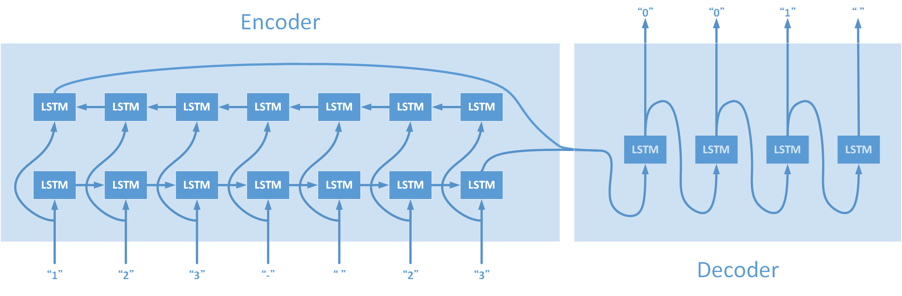

# Data Science and Artificial Intelligence Practice Homework
DSAI HW3-Substractor

## Prerequisite
- Python 3.6.4

## Install Dependency
```sh
$ pip install -r requirements.txt
```

## Usage
```sh
$ python main.py [-o OPTION] [-t TYPE] [-d DATA] [-m MODEL]
```
|                            | Description                                    |
| ---                        | ---                                            |
| **General Options**        |                                                |
| -h, --help                 | show this help message and exit                |
| **Operational Options**    |                                                |
| -o gen                     | data generation                                |
| -o train                   | training model                                 |
| -o report\_training\_data  | show all training data                         |
| -o report\_validation\_data| show all validation data                       |
| -o report\_testing\_data   | show all testing data                          |
| -o report\_accuracy        | show accuracy                                  |
| -o test                    | input formula by self                          |
| **Calculational Options**  | **Default `-t sub`**                           |
| -t sub                     | subtraction                                    |
| -t sub\_add                | subtraction mix with addition                  |
| -t multiply                | multiplication                                 |
| **Advance Options**        |                                                |
| -d DATA                    | input the path of training (or generation) data|
|                            | (default: `src/data.pkl`)                      |
| -m MODEL                   | input the path of model                        |
|                            | (default: `src/my_model.h5`)                   |


## Architecture
### Model


- Using sequence to sequence model
- Encoder: bi-directional LSTM (Hidden Size = 256)
- Decoder: LSTM (Hidden Size = 512)

| Layer (type)                    | Output Shape        | Param #    | Connected to                     |
| ------------------------------- | ------------------- | ---------: | -------------------------------- |
| input\_1 (InputLayer)           | (None, 7, 12)       | 0          |                                  |
| ------------------------------- | ------------------- | ---------- | -------------------------------- |
| bidirectional\_1 (Bidirectional)| \[(None, 512), ...  | 550912     | input\_1[0][0]                   |
| ------------------------------- | ------------------- | ---------- | -------------------------------- |
| reshape\_1 (Reshape)            | (None, 1, 512)      | 0          | bidirectional\_1[0][0]           |
| ------------------------------- | ------------------- | ---------- | -------------------------------- |
| concatenate\_1 (Concatenate)    | (None, 512)         | 0          | bidirectional\_1[0][1]           |
|                                 |                     |            | bidirectional\_1[0][3]           |
| ------------------------------- | ------------------- | ---------- | -------------------------------- |
| concatenate\_2 (Concatenate)    | (None, 512)         | 0          | bidirectional\_1[0][2]           |
|                                 |                     |            | bidirectional\_1[0][4]           |
| ------------------------------- | ------------------- | ---------- | -------------------------------- |
| lstm\_2 (LSTM)                  | \[(None, 512), ...  | 2099200    | reshape\_1[0][0]                 |
|                                 |                     |            | concatenate\_1[0][0]             |
|                                 |                     |            | concatenate\_2[0][0]             |
|                                 |                     |            | reshape\_1[0][0]                 |
|                                 |                     |            | lstm\_2[0][1]                    |
|                                 |                     |            | lstm\_2[0][2]                    |
|                                 |                     |            | reshape\_1[0][0]                 |
|                                 |                     |            | lstm\_2[1][1]                    |
|                                 |                     |            | lstm\_2[1][2]                    |
|                                 |                     |            | reshape\_1[0][0]                 |
|                                 |                     |            | lstm\_2[2][1]                    |
|                                 |                     |            | lstm\_2[2][2]                    |
| ------------------------------- | ------------------- | ---------- | -------------------------------- |
| dense\_1 (Dense)                | (None, 12)          | 6156       | lstm\_2[0][0]                    |
| ------------------------------- | ------------------- | ---------- | -------------------------------- |
| dense\_2 (Dense)                | (None, 12)          | 6156       | lstm\_2[1][0]                    |
| ------------------------------- | ------------------- | ---------- | -------------------------------- |
| dense\_3 (Dense)                | (None, 12)          | 6156       | lstm\_2[2][0]                    |
| ------------------------------- | ------------------- | ---------- | -------------------------------- |
| dense\_4 (Dense)                | (None, 12)          | 6156       | lstm\_2[3][0]                    |
| ------------------------------- | ------------------- | ---------- | -------------------------------- |
| concatenate\_3 (Concatenate)    | (None, 48)          | 0          | dense\_1[0][0]                   |
|                                 |                     |            | dense\_2[0][0]                   | 
|                                 |                     |            | dense\_3[0][0]                   |
|                                 |                     |            | dense\_4[0][0]                   |
| ------------------------------- | ------------------- | ---------- | -------------------------------- |
| reshape\_2 (Reshape)            | (None, 4, 12)       | 0          | concatenate\_3[0][0]             |
| ------------------------------- | ------------------- | ---------- | -------------------------------- |
| lambda\_1 (Lambda)              | (None, 4, 12)       | 0          | reshape\_2[0][0]                 |
| ------------------------------- | ------------------- | ---------- | -------------------------------- |
| Total params: 2,674,736         |                     |            |                                  | 
| Trainable params: 2,674,736     |                     |            |                                  | 
| Non-trainable params: 0         |                     |            |                                  | 


### Result
#### Data Size
- Training Data: 18,000
- Validation Data: 2,000

##### Subtraction
- Report Training Data
```sh
$ python main.py -o report_training_data -t sub -d src/sub_data.pkl
```

```sh
 19-  9 =   10
 46-  3 =   43
522-  2 =  520
772-  7 =  765
 93- 46 =   47
 43-  2 =   41
 78- 75 =    3
815- 10 =  805
 93-  0 =   93
387-100 =  287
...
316- 63 =  253
491- 67 =  424
628- 78 =  550
321-  0 =  321
836- 61 =  775
577- 23 =  554
728-724 =    4
988-984 =    4
615-  8 =  607
247- 24 =  223
```

- Report Validation Data
```sh
$ python main.py -o report_validation_data -t sub -d src/sub_data.pkl
```

```sh
112- 61 =   51
367-  4 =  363
933-462 =  471
565- 28 =  537
941- 10 =  931
389- 88 =  301
639-  8 =  631
980- 73 =  907
 48- 44 =    4
872- 37 =  835
...
996- 65 =  931
516- 64 =  452
610- 44 =  566
789- 77 =  712
325- 84 =  241
537- 43 =  494
870- 46 =  824
975- 56 =  919
514-386 =  128
430- 28 =  402
```

- Training
```sh
$ python main.py -o train -t sub -d src/sub_data.pkl -m src/sub_model.h5
```
| Iteration | Training - Loss | Training - Accuracy | Validation - Loss | Validation - Accuracy |
| ---:      | ---:            | ---:                | ---:              | ---:                  |
| 1         | 1.4852          | 0.4426              | 1.2828            | 0.5065                |
| 5         | 0.1766          | 0.9480              | 0.1467            | 0.9639                |
| 10        | 0.0181          | 0.9963              | 0.0376            | 0.9898                |
| 20        | 9.8986e-04      | 1.0000              | 0.0027            | 0.9995                |
| 50        | 3.2450e-05      | 1.0000              | 5.0350e-04        | 0.9998                |
| 90        | 8.1144e-07      | 1.0000              | 1.2241e-04        | 1.0000                |
| 100       | 3.8978e-07      | 1.0000              | 1.3457e-04        | 0.9999                |

- Detail: [list/sub.txt](list/sub.txt)

##### Subtraction & Addition
- Report Training Data
```sh
$ python main.py -o report_training_data -t sub_add -d src/sub_add_data.pkl
```

```sh
753+517 = 1270
290+  1 =  291
936+670 = 1606
 29+ 69 =   98
  2+ 26 =   28
751-485 =  266
472-332 =  140
 61+  2 =   63
 21-  2 =   19
  4-  1 =    3
...
  2+764 =  766
808+ 82 =  890
534- 40 =  494
489-412 =   77
884+  1 =  885
162+ 99 =  261
  8+111 =  119
902+ 28 =  930
917-431 =  486
941+  8 =  949
```

- Report Validation Data
```sh
$ python main.py -o report_validation_data -t sub_add -d src/sub_add_data.pkl
```

```sh
 70- 39 =   31
 87- 18 =   69
125+ 83 =  208
 91- 62 =   29
993-  1 =  992
922-716 =  206
 77- 65 =   12
696+609 = 1305
 91- 37 =   54
983-  1 =  982
...
339+ 61 =  400
 17- 11 =    6
181-  0 =  181
 33+563 =  596
643-144 =  499
623+  9 =  632
  2+836 =  838
 52- 32 =   20
583- 11 =  572
 80- 14 =   66
```

- Training
```sh
$ python main.py -o train -t sub_add -d src/sub_add_data.pkl -m src/sub_add_model.h5
```
| Iteration | Training - Loss | Training - Accuracy | Validation - Loss | Validation - Accuracy |
| ---:      | ---:            | ---:                | ---:              | ---:                  |
| 1         | 1.6064          | 0.4058              | 1.4543            | 0.4382                |
| 5         | 0.8558          | 0.6709              | 0.8422            | 0.6756                |
| 10        | 0.1017          | 0.9757              | 0.1315            | 0.9630                |
| 20        | 0.0118          | 0.9979              | 0.0528            | 0.9808                |
| 50        | 1.2783e-04      | 1.0000              | 0.0168            | 0.9940                |
| 90        | 3.1497e-06      | 1.0000              | 0.0158            | 0.9954                |
| 100       | 1.3416e-06      | 1.0000              | 0.0159            | 0.9955                |

- Detail: [list/sub_add.txt](list/sub_add.txt)

##### Multiplication
- Report Training Data
```sh
$ python main.py -o report_training_data -t multiply -d src/multiply_data.pkl 
```

```sh
 48* 22 =   1056
765*450 = 344250
  9*362 =   3258
415*174 =  72210
  9*529 =   4761
 55*692 =  38060
510*507 = 258570
504*765 = 385560
  8* 64 =    512
  3*784 =   2352
...
931* 82 =  76342
744*735 = 546840
266*837 = 222642
929*350 = 325150
 45*308 =  13860
  6*508 =   3048
143*346 =  49478
 56*155 =   8680
471* 70 =  32970
 27*114 =   3078
```

- Report Validation Data
```sh
$ python main.py -o report_validation_data -t multiply -d src/multiply_data.pkl 
```

```sh
  8*747 =   5976
 74*627 =  46398
 84* 92 =   7728
  0*698 =      0
  0*799 =      0
 97*659 =  63923
560* 48 =  26880
358* 20 =   7160
768*184 = 141312
  3*188 =    564
...
  1*278 =    278
  9*960 =   8640
 33*245 =   8085
 27*820 =  22140
 77*556 =  42812
 63* 41 =   2583
368*206 =  75808
  2*741 =   1482
481* 99 =  47619
  7*165 =   1155
```

- Training
```sh
$ python main.py -o train -t multiply -d src/multiply_data.pkl -m src/multiply_model.h5
```
| Iteration | Training - Loss | Training - Accuracy | Validation - Loss | Validation - Accuracy |
| ---:      | ---:            | ---:                | ---:              | ---:                  |
| 1         | 1.5895          | 0.4119              | 1.5240            | 0.4108                |
| 5         | 1.1138          | 0.5550              | 1.1871            | 0.5237                |
| 10        | 0.7988          | 0.7009              | 0.8966            | 0.6535                |
| 20        | 0.3836          | 0.8751              | 0.8373            | 0.7067                |
| 50        | 0.0014          | 1.0000              | 1.4167            | 0.7122                |
| 90        | 2.1619e-05      | 1.0000              | 1.8911            | 0.7137                |
| 100       | 8.5965e-06      | 1.0000              | 1.9949            | 0.7149                |

- Detail: [list/multiply.txt](list/multiply.txt)

#### Data Size
- Training Data: 64,000
- Validation Data: 16,000

##### Subtraction & Addition
- Training

| Iteration | Training - Loss | Training - Accuracy | Validation - Loss | Validation - Accuracy |
| ---:      | ---:            | ---:                | ---:              | ---:                  |
| 1         | 1.6879          | 0.3748              | 1.5375            | 0.3973                |
| 5         | 0.8637          | 0.6727              | 0.8221            | 0.6861                |
| 10        | 0.0658          | 0.9900              | 0.0974            | 0.9776                |
| 20        | 0.0027          | 1.0000              | 0.0049            | 0.9997                |
| 50        | 1.2187e-04      | 1.0000              | 7.1634e-04        | 0.9998                |
| 90        | 6.8752e-06      | 1.0000              | 2.9419e-04        | 0.9999                |
| 100       | 3.2996e-06      | 1.0000              | 2.9259e-04        | 0.9999                |

- Detail: [Subtractor.ipynb](https://nbviewer.jupyter.org/github/yutongshen/DSAI-HW3-Subtractor/blob/master/Subtractor.ipynb)

## Related Link
- [nbviewer](https://nbviewer.jupyter.org/github/yutongshen/DSAI-HW3-Subtractor/blob/master/Subtractor.ipynb)

## Authors
[Yu-Tong Shen](https://github.com/yutongshen/)
